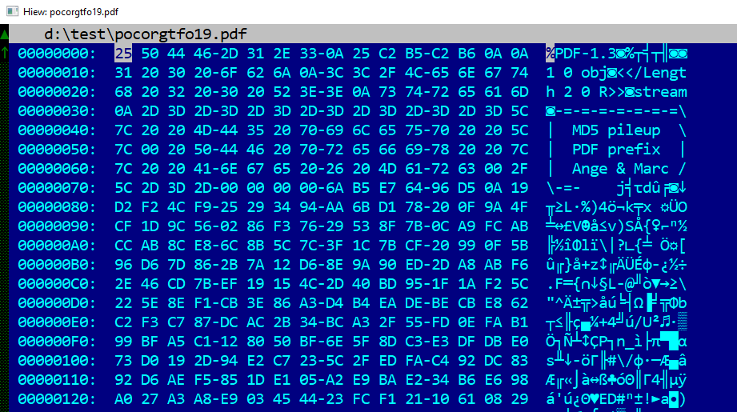
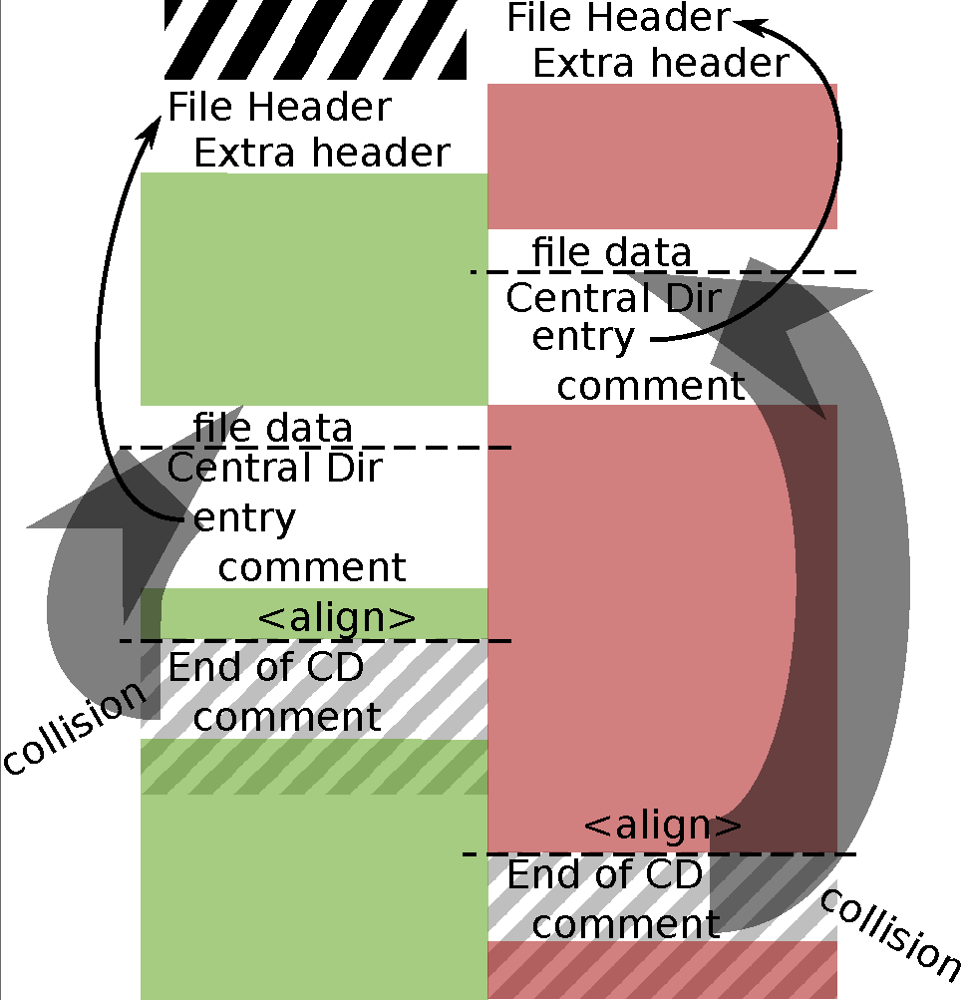
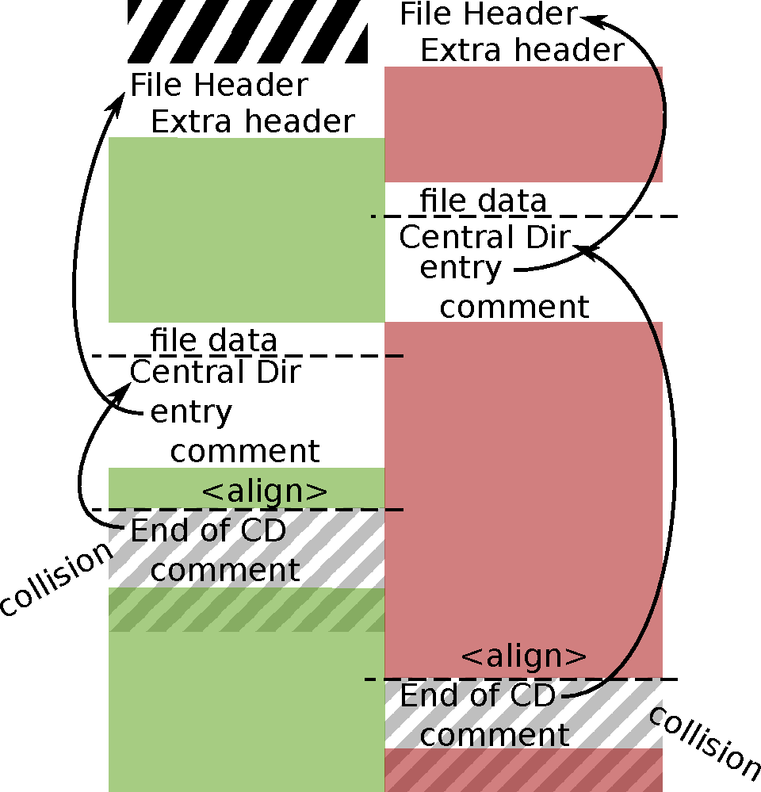
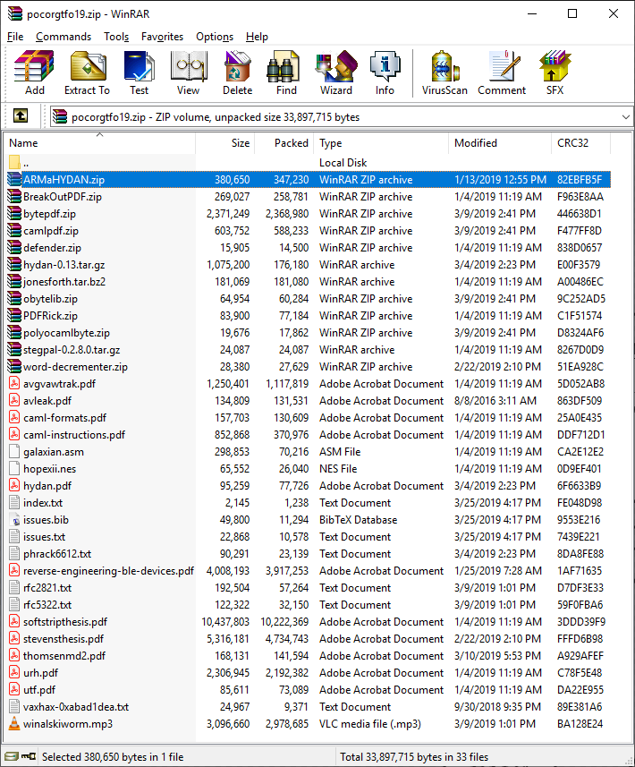
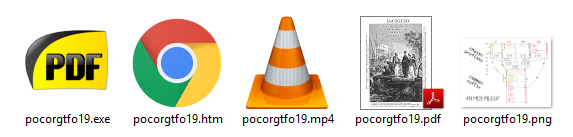
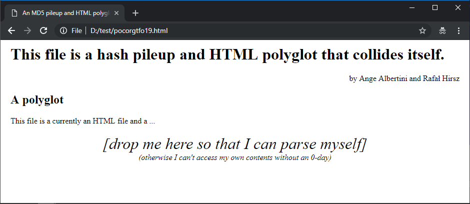
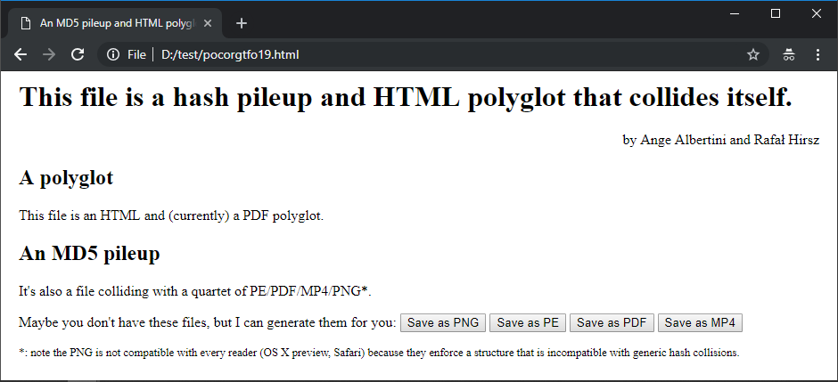
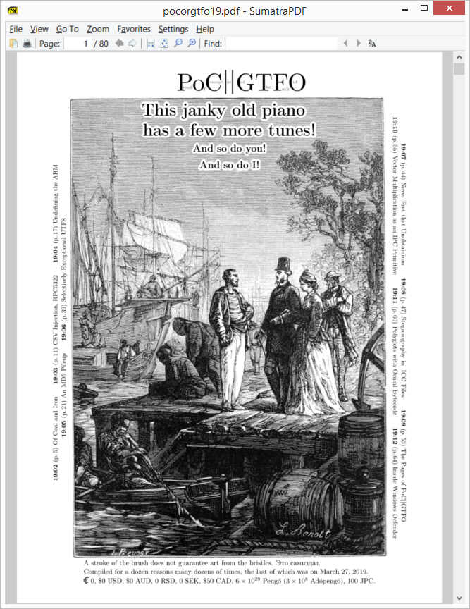
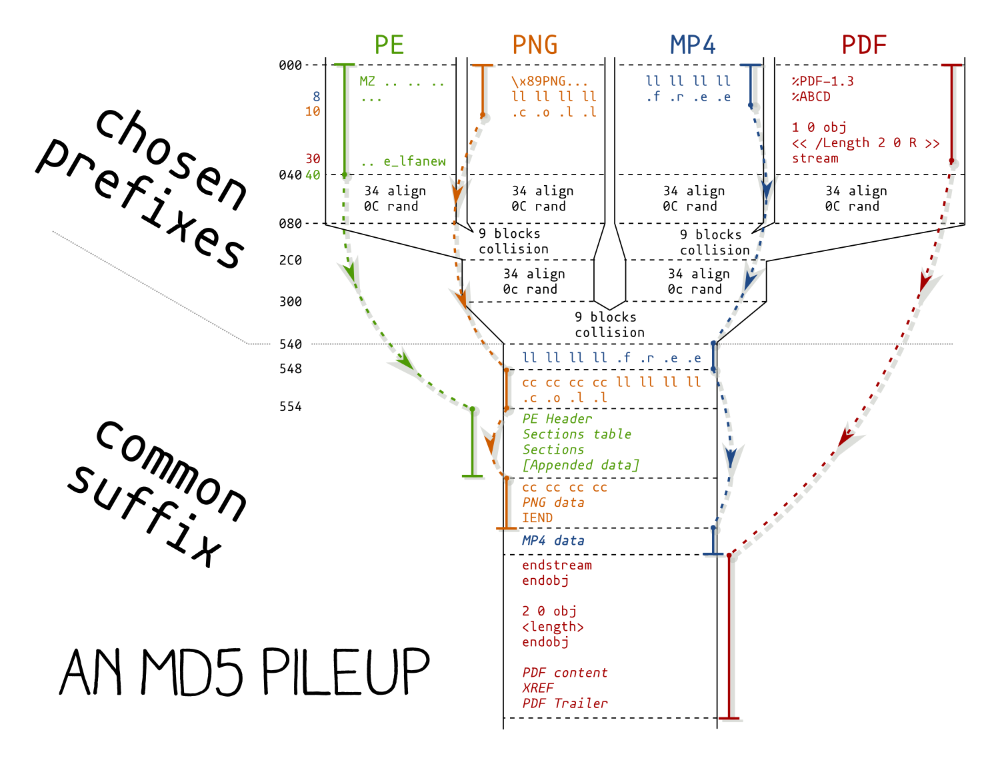
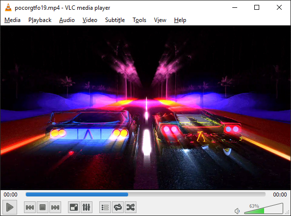

Here's a write-up of the PoC||GTFO 0x19 issue.


# Overview

## a polyglot file

### a PDF document (initially)

The file is a 80 page PDFLaTeX-generated document, and normalized via `mutool clean`.


*the main Page*




*the PDF header*

#### manual compatibility fix

The compatibility of this issue was tricky:
some very simple vector drawings with Inkscape
were corrupting Android & Kindle viewers and some MuPDF versions,
but no other viewer or tool.

These drawings are very standard and without any fancy feature
(for example, gradients are typically wrong under Safari),
but the page would stop rendering after these illustrations,
while all the other pages were rendered fine.

Running GhostScript on the file
(thanks [Kurt](https://twitter.com/pdfkungfoo) for the pointer!) shows the following error:

```
   **** Error: Ignoring spurious ET operator.
               Output may be incorrect.
   **** Error: Executing Do inside a text block, attempting to recover
               Output may be incorrect.
```

But it also displays the buggy picture - while all other softwares with bugs
just stopped the rendering,
and most software would just overcome the mistake and display it the expected way!



*a drawing with two arrows too thick*

After running `mutool clean -d` to decompress the page contents,
one can find:

``` PostScript
[...]
0 0 0 rg BT
25.980761 15 15 -25.980761 612.950443 680.352788 Tm
/f-0-0 1 Tf
[(collision)]TJ
25.980761 -15 -15 -25.980761 6.96737 586.05846 Tm
q
[(collision)]TJ
ET
1 0 0 1 0 0 cm
[...]
```

PDF has a lot of operators that have to be balanced
(see GenDX's operators [cheat sheet](https://github.com/gendx/pdf-cheat-sheets)),
and notably here:
- `BT` (Begin Text) and `ET` (End Text)
- `q` (push state) and `Q` (pop state).

Clearly here, the *End Text* tag `ET` is after the graphical state push `q`, unbalanced.

The quickest fix was to patch the page contents manually and rebalance the operators,
then recompress the PDFs:

``` PostScript
[...]
[(collision)]TJ
ET
q
1 0 0 1 0 0 cm
[...]
```



*a drawing with all arrows just fine*

So just make sure you run GhostScript in your testing pipeline if you want better compatibility.

### a ZIP archive

The file is also a valid ZIP file:



*a valid ZIP archive*

### an HTML page

The file is also an HTML page with JavaScript payload.

## an MD5 pile-up

A tree of 3 chosen-prefix collisions of MD5 have been computed,
so that for any suffixes, 4 prefixes can be swapped, and the file will keep its MD5.

Each of these suffix start a different file type:
a PDF document, a PE executable,
a PNG image and an MP4 video.



*ZIP, HTML, and (PDF ^ EXE ^ PNG ^ MP4)*

MD5s:
```
ac75bf434f3624612cc3b6ee1aa59218 *pocorgtfo19.pdf
ac75bf434f3624612cc3b6ee1aa59218 *pocorgtfo19.mp4
ac75bf434f3624612cc3b6ee1aa59218 *pocorgtfo19.exe
ac75bf434f3624612cc3b6ee1aa59218 *pocorgtfo19.png
```

SHA2s:
```
891b6c4e0cc8f88af2b8c2467c1558b806d2f21be4c7518e7833c27885713464 *pocorgtfo19.pdf
a324d093f178e54cf6d159a9a005204761ffa7b0cb539e328a8371388167cc70 *pocorgtfo19.mp4
0c5e147a27ce71d2e2eb1e5618a08aa0f67d2dc8e9a9f1ed119de3938318dfc6 *pocorgtfo19.exe
76ecc052df4b264a3653822a902ef2db6c042807f12d498d8e7f4dd5ada1724f *pocorgtfo19.png
```

<!--
digraph G {
rankdir = LR;
node [shape = octagon]
edge [dir=none]
prefix [shape = triangle]
collision
C3 [label = "Chosen Prefix 3"]
C2 [label = "Chosen Prefix 2"]
C1 [label = "Chosen Prefix 1"]

node [shape = triangle]
PDF -> C1
PE -> C1
PNG -> C2
MP4 -> C2
C1 -> C3
C2 -> C3

node [shape = none]

start [label = "start of file"]

C3 -> "PE header" -> "HTML payload" -> "PE sections" -> "PNG image" -> "MP4 content" -> "PDF body" -> "ZIP archive"

{rank=same; C3; "prefix end";}
{rank=same; "PE header"; "suffix start";}
{rank=same; PNG; start;}
{rank=same; "ZIP archive";"end of file";}

edge [style="invis"]
prefix -> collision
start -> "prefix end" -> "suffix start" -> "end of file"
}
-->


*layout of the file*

These 4 prefixes were embedded in the JavaScript payload of an HTML page,
embedded in the file suffix - the rest of the file is commented out.

``` JavaScript
prefixPNG = "iVBORw0K..."
prefixPDF = "JVBERi0x..."
prefixMP4 = "AAAAbGZy..."
prefixPE =  "TVo9LT0t..."
// [...]
```

# Write-up

## Rename extension

If you rename the original `pocorgtfo19.pdf` as `.html` page and open it in a browser,
you see this page.



*the HTML payload in a brower*

The page payload escapes out of the whole file so that the browser stops loading the whole file
(which is 64 Mb).

``` JavaScript
document.documentElement.innerHTML = document.getElementById('mypage').innerHTML;
```

## Drop file onto itself

The JavaScript of the page only has access to the HTML part of the file,
so you need to drop the file on the html page so that it can read the whole file and identify the prefix.

The JavaScript payload identifies the prefix of the current file, and lets you save the file with any of the 4 prefixes.



*the HTML payload once the file was dropped onto itself*

Note that typically downloading .EXE extensions is forbidden,
so you'll need to rename the .EX file to be able to run it.

# Colliding payloads

## Portable executable

The PE payload is a PDF viewer, Sumatra, version 1.8 (from 2011):
it's standalone, fairly small, and the earliest version that renders the whole doc properly.

So the self-collision of the file can view itself.



*the PDF payload showing the colliding PDF file*

#### manual compatibility fix

It was compressed with [UPX](https://upx.github.io/) so that the PDF keywords it contains
don't interfere with the parsing of the PDF part of the file.

Since it uses the MSVC library,
some checks have been [patched out](http://www.manhunter.ru/underground/65_runtime_error_r6002_floating_point_not_loaded.html)
since altering the PE header for the collisions will interfere with the UPX de-packing,
leading to incorrect sections permissions,
wich will prevent it to work after a misleading `Runtime R6002 - floating point not loaded` error.

Patch this:

``` x86
C1E81F shr   eax,01F
F7D0   not   eax
83E001 and   eax,1
```
to set `eax` to 1 instead.

## Portable Network Graphics image

The PNG image is a diagram of the pileup.

It will not open in Safari or OS X preview because they expect the file to start with its `IHDR` chunk and not collision blocks.


<!--  -->

## MP4 video

The last colliding file is a short looping video by [KidMoGraph](https://www.kidmograph.com/) that shows 2 cars racing next to each other, almost... *colliding*:



*a near-collision video loop*
